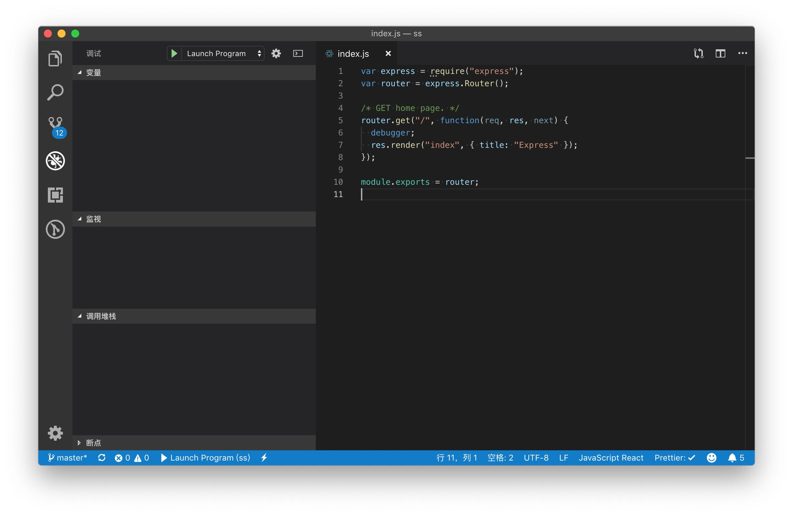

# NodeJS 中的代码调试

## 命令行方式

在执行 node 程序时添加 `inspect` 参数(针对新版 Node 哈，老的用 `debug`)，如使用 `express-generator` 创建一个最简单的项目

```bash
npx express-generator debug-with-node
```

修改 `package.json` 中 `start` 命令的参数

```diff
- "start": "node ./bin/www"
+ "start": "node inspect ./bin/www"
```

### 添加断点 **debugger**

```js
router.get("/", function(req, res, next) {
  debugger;
  res.render("index", { title: "Express" });
});
```

那么在执行的时候就会进入 `DEBUG` 模式，**启动后，调试器会在代码第一行进行调试状态**

示例：

```bash
$ npm start # 启动服务

> node inspect ./bin/www # 日志输出 inspect 参数的真实命令

< Debugger listening on ws://127.0.0.1:9229/f73f449d-db27-474a-bf8f-cf41d65e9490
< For help, see: https://nodejs.org/en/docs/inspector
< Debugger attached.
Break on start in file://~/debug-with-node/bin/www:1
> 1
  2
  3 /**
debug> c # 输入 c 跳过调试状态，让服务先启动
break in file://~/debug-with-node/routes/index.js:6
  4 /* GET home page. */
  5 router.get("/", function(req, res, next) {
> 6   debugger;
  7   res.render("index", { title: "Express" });
  8 });
debug> watch("req") # 输入 watch("req") ，监听 req
debug> n # 输入 n ，下一步
break in file://~/debug-with-node/routes/index.js:7
Watchers:
  0: req =
    { _readableState: ReadableState,
      readable: true,
      _events: Object,
      _eventsCount: 1,
      _maxListeners: 'undefined',
      ... }

  5 router.get("/", function(req, res, next) {
  6   debugger;
> 7   res.render("index", { title: "Express" });
  8 });
  9
debug> c # 输入 c 跳过，进入下一个调试状态
< GET / 304 24014.341 ms - -
< GET /stylesheets/style.css 304 2.951 ms - -
debug>
```

**使用 `inspect` 参数启动调试后，可以使用 `help` 命令，查看调试器的所有命令。所有命令如下**

Commands:

```
run (r)
cont (c)
next (n)
step (s)
out (o)
backtrace (bt)
setBreakpoint (sb)
clearBreakpoint (cb)
watch
unwatch
watchers
repl
restart
kill
list
scripts
breakOnException
breakpoints
version
```

### 调试步骤

- `cont` 或 `c`: 继续执行代码
- `next` 或 `n`: 执行下一步，逐步代码
- `step` 或 `s`: 进入调用的方法内部
- `out` 或 `o`: 跳出本层方法，进入上层。通过 `step` 或 `s` 命令进入调用方法后，可通过本命令跳出

### 断点

- `setBreakpoint()` 或 `sb()`: 在当前行设置断点
- `setBreakpoint(line)` 或 `sb(line)`: 在指定行设置断点
- `setBreakpoint('fn()')` 或 `sb(...)`: 在函数体的第一条语句设置断点
- `setBreakpoint('script.js', 1)` 或 `sb(...)`: 在 `script.js` 文件的的第一行设置断点
- `clearBreakpoint()` 或 `cb(...)`: 清除断点

断点功能不仅限于当前执行的文件中，未被加载的文件或模块也可以通过 setBreakpoint 方法设置断点。

### 信息查看

- `backtrace` 或 `bt`: 显示当前执行模块的回溯，即：调用顺序
- `list(5)`: 显示当前调试位置附近的源代码。例如：`list(5)`，则显示脚本调试位置源代码上 5 行和下 5 行
- `watch(expr)`: 向监视列表添加表达式。例如：`watch('i')`，为添加变量 i 的监视器，字符串格式！
- `unwatch(expr)`: 从监视列表移除表达式
- `watchers`: 列出所有监视器和它们的值（每个断点会自动列出）
- `repl`: 在所调试的脚本的上下文中打开调试器的 `repl` 执行代码

### 流程控制

- `pause`: 暂停执行代码（类似于开发工具中的暂停按钮）
- `restart`: 重新运行脚本，可用于重启调试
- `kill`: 终止脚本
- `run`: 运行脚本（调试器开始时自动运行）。可用于 `kill` 命令停止调试后再启动

## VSCode 调试

在项目中断点 **debugger**，然后点击左侧 `调试图标`，进入调试界面，然后点击 `设置图标`，进行添加调试配置
，最后点击绿色三角 `启动图标` 即可调试

<div align="center">

</div>

自动生成的配置如下：

```json
{
  "version": "0.2.0",
  "configurations": [
    {
      "type": "node",
      "request": "launch",
      "name": "Launch Program",
      "program": "${workspaceFolder}/bin/www"
    }
  ]
}
```

## 参考

- [使用 Node.js 自带的 V8 调试器调试 Node 程序](https://itbilu.com/nodejs/core/VyMcjFEw.html)
